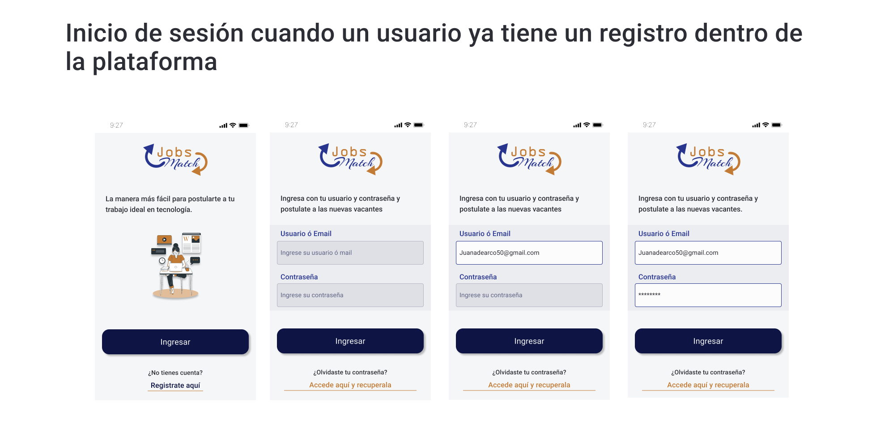

# c9-40-m-reactnative

  

<h2 align="center">
  Una solución para buscar esa oportunidad laboral soñada. 
</h2>

<h3 align="center">
Aplicación desarrollada en React Native por el equipo c9-40-m-reactnative
 </h3>

  <a href="#about-the-project">Acerca del Proyecto</a> |
  <a href="#layout">Diseño</a> |
  <a href="#technologies">Tecnologias</a> |
  <a href="#authors">Autores</a> |
  <a href="#license">License</a>

 

---

<h4 align="center">
	🚧 Status: Building 🚀  🚧

  
 Despliegue temporal : https://expo.dev/accounts/taguara/projects/jobsmatch/builds/9c295edc-c987-45f7-a214-fc0215ca5278 

  
  <a href="https://jobsmatch.vercel.app/"> Landing Page jobsmatch</a>

</h4>

---

 

<h2 id="about-the-project" > ⏰📈 Acerca del Proyecto </h2>

**App** desarrollada por el equipo **c9-40-m-reactnative** usando **React Native** en el Frontend y **Nodejs - PostGre** como stack base en la simulación de un ambiente de trabajo patrocinado por **No Country**.

### Justificación

Los usurios que buscan trabajo dedican una gran cantidad de tiempo al llenado de solictudes, El propósito de esta aplicación es reducir el tiempo que toma completar formularios en línea para buscar trabajo. Al simplificar el proceso de llenado de formularios con información personal y laboral previamente guardada por el usuario, se busca hacer más eficiente y rápido el proceso de solicitar empleo. La aplicación está diseñada para simplificar la tarea de solicitar trabajo en línea y ayudar a los usuarios a hacer match con oportunidades laborales más rápidamente, permitiéndoles enfocarse en la búsqueda de trabajo en lugar de gastar tiempo llenando múltiples formularios repetitivos.

---

<h2 id="layout" >🎨  Diseño </h2>

The ecommerce preview:

**NOTE:** In each image, there will be a short review of how the process was to build the result seen.

---

### Inicio

---

### Registro

